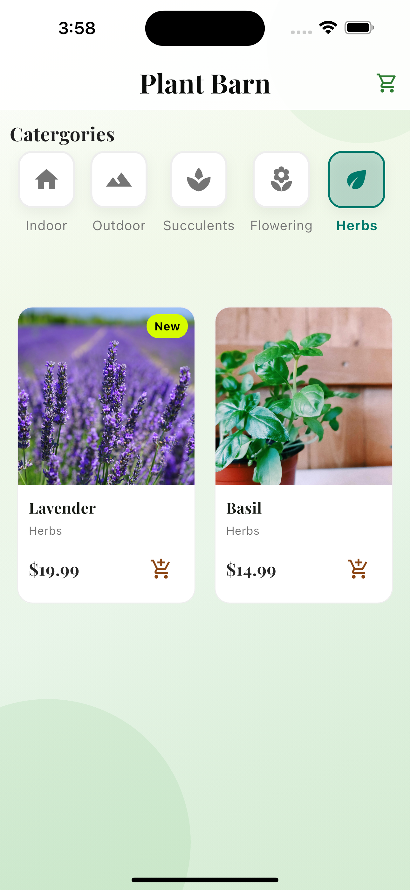

# Plantmart# EcoFlora - Flutter Application

A beautiful and modern Flutter application for a plant store, focusing on an elegant user interface and smooth user experience.

## 🌿 Features

### Plant Store Screen
- Elegant grid layout displaying various plants
- Category filtering (Indoor, Outdoor, Succulents, Flowering, Herbs)
- Beautiful plant cards with images, names, and prices
- Smooth animations and transitions
- Responsive design for different screen sizes

### Shopping Cart
- Interactive cart management
- Real-time price updates
- Quantity adjustment for items
- Swipe-to-delete functionality
- Empty cart state handling

### Checkout Process
- Animated checkout button
- Smooth page transitions
- Order summary
- Shipping information form
- Payment method selection

## 🎨 UI/UX Highlights
- Modern and clean design
- Playfair Display typography for elegant text
- Consistent color scheme with green accents
- Smooth animations and transitions
- Responsive layout
- Intuitive navigation

## 🛠️ Technical Features
- State management using Provider
- Custom animations and transitions
- Responsive image loading
- Error handling for network images
- Clean architecture with separate models and providers

## 📱 Screenshots

### Main Screens
| Home Screen | Category View | Plant Details |
|-------------|---------------|---------------|
|  |  |  |

### Shopping Experience
| Shopping Cart |
|---------------|
|  | 


## 🚀 Getting Started

### Prerequisites
- Flutter SDK (latest version)
- Dart SDK (latest version)
- Android Studio / VS Code
- Git

### Installation
1. Clone the repository:
```bash
git clone https://github.com/Timothy-itayi/Plantmart
```

2. Navigate to the project directory:
```bash
cd flutter_application_1
```

3. Install dependencies:
```bash
flutter pub get
```

4. Run the application:
```bash
flutter run
```


